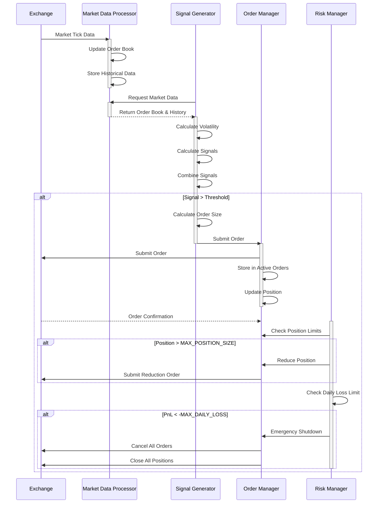

# HFT Algorithm Implementation - Technical Deep Dive

## Table of Contents
1. [Project Overview](#project-overview)
2. [Architecture Deep Dive](#architecture-deep-dive)
3. [Processing Flow](#processing-flow)
4. [Core Components](#core-components)
5. [Data Models](#data-models)
6. [Signal Generation Strategies](#signal-generation-strategies)
7. [Risk Management System](#risk-management-system)
8. [API Reference](#api-reference)
9. [Configuration](#configuration)
10. [Development Guide](#development-guide)
11. [Performance Characteristics](#performance-characteristics)
12. [Deployment](#deployment)

## Project Overview

This is a comprehensive Spring Boot application that implements High-Frequency Trading (HFT) algorithms for educational and research purposes. The system demonstrates sophisticated algorithmic trading concepts including multi-strategy signal generation, comprehensive risk management, and real-time order execution simulation.

### Key Features
- **Multi-threaded Architecture**: Concurrent processing of market data, signal generation, order management, and risk monitoring
- **Three-Strategy Signal Generation**: Statistical arbitrage, mean reversion, and momentum strategies with configurable weights
- **Advanced Risk Management**: Position limits, daily loss limits, volatility adjustments, and emergency shutdown procedures
- **Real-time Performance Monitoring**: Latency tracking, order counts, P&L monitoring, and performance metrics
- **REST API Interface**: Complete control and monitoring through HTTP endpoints
- **Configurable Parameters**: Extensive configuration through application properties

### Technology Stack
- **Java 21**: Latest LTS version with modern language features
- **Spring Boot 3.4.5**: Enterprise-grade framework with auto-configuration
- **Spring Web**: RESTful API development
- **Spring JPA**: Data persistence (configured with H2 database)
- **Spring Actuator**: Production-ready monitoring and management
- **Lombok**: Reduced boilerplate code
- **Maven**: Build automation and dependency management

## Architecture Deep Dive

### High-Level System Design

```
┌─────────────────────────────────────────────────────────────────┐
│                    HFT Algorithm System                         │
├─────────────────────────────────────────────────────────────────┤
│  ┌─────────────────┐    ┌─────────────────┐    ┌──────────────┐ │
│  │ Market Data     │    │ Signal          │    │ Order        │ │
│  │ Processor       │◄──►│ Generator       │◄──►│ Manager      │ │
│  │ (Thread 1)      │    │ (Thread 2)      │    │ (Thread 3)   │ │
│  └─────────────────┘    └─────────────────┘    └──────────────┘ │
│           │                       │                      │       │
│           ▼                       ▼                      ▼       │
│  ┌─────────────────────────────────────────────────────────────┐ │
│  │              Risk Manager (Thread 4)                       │ │
│  │        Monitors all components and enforces limits         │ │
│  └─────────────────────────────────────────────────────────────┘ │
├─────────────────────────────────────────────────────────────────┤
│                    Data Layer                                   │
│  ┌─────────────┐ ┌─────────────┐ ┌─────────────┐ ┌─────────────┐│
│  │ Order Books │ │ Market      │ │ Active      │ │ Positions   ││
│  │ (Real-time) │ │ History     │ │ Orders      │ │ & P&L       ││
│  └─────────────┘ └─────────────┘ └─────────────┘ └─────────────┘│
└─────────────────────────────────────────────────────────────────┘
```

### Threading Model

The system employs a sophisticated multi-threaded architecture with dedicated threads for each major component:

1. **Market Data Processor Thread** (1ms sleep cycle)
   - Processes incoming market ticks
   - Updates order books in real-time
   - Maintains historical data with fixed lookback window
   - Calculates processing latency metrics

2. **Signal Generator Thread** (5ms sleep cycle)
   - Analyzes market data and historical patterns
   - Executes three distinct trading strategies
   - Combines signals with weighted approach
   - Makes trading decisions based on signal strength

3. **Order Manager Thread** (10ms sleep cycle)
   - Handles order lifecycle management
   - Updates existing orders based on market changes
   - Manages order staleness (100ms timeout)
   - Simulates exchange interactions

4. **Risk Manager Thread** (100ms sleep cycle)
   - Monitors position limits and exposure
   - Tracks daily P&L against loss limits
   - Triggers emergency shutdown when necessary
   - Enforces position reduction when limits exceeded

### Processing Flow



## Core Components

### 1. HFTAlgorithm (`core/HFTAlgorithm.java`)

The main orchestrator class that coordinates all system components:

**Key Responsibilities:**
- Manages the lifecycle of all trading threads
- Coordinates communication between components
- Provides unified interface for system control
- Handles emergency shutdown procedures
- Maintains system performance metrics

**Configuration Parameters:**
- `MAX_POSITION_SIZE`: Maximum position value per symbol (default: 1,000,000)
- `MAX_ORDER_SIZE`: Maximum individual order size (default: 100,000)
- `MAX_DAILY_LOSS`: Daily loss limit triggering shutdown (default: 50,000)
- `LOOKBACK_PERIOD`: Historical data window size (default: 100 ticks)
- `SIGNAL_THRESHOLD`: Minimum signal strength to trade (default: 0.0002)

**Threading Architecture:**
```java
ExecutorService executorService = Executors.newFixedThreadPool(4);
executorService.submit(this::marketDataProcessor);
executorService.submit(this::signalGenerator);
executorService.submit(this::orderManager);
executorService.submit(this::riskManager);
```

### 2. AlgorithmService (`service/AlgorithmService.java`)

Spring service layer that provides abstraction over the core algorithm:

**Features:**
- Spring-managed lifecycle with `@PreDestroy` cleanup
- Initialization of default test symbols (BTC-USD, ETH-USD, SOL-USD)
- Data transformation for API responses
- Exception handling and error management

### 3. AlgorithmController (`controller/AlgorithmController.java`)

REST API controller providing external interface:

**Endpoints:**
- Algorithm control (start/stop/status)
- Position and order book monitoring
- Performance metrics access
- Market data simulation
- Dynamic symbol addition

## Data Models

### MarketTick
Represents a single market data update with bid/ask information:
```java
public class MarketTick {
    private final String symbol;      // Trading symbol (e.g., "BTC-USD")
    private final double bid;         // Best bid price
    private final double ask;         // Best ask price  
    private final double bidSize;     // Quantity at bid
    private final double askSize;     // Quantity at ask
    private final Instant timestamp;  // Tick timestamp
}
```

### OrderBook
Maintains real-time order book state for each symbol:
```java
public class OrderBook {
    private final String symbol;
    private double bid, ask, bidSize, askSize;
    private final Map<Double, Double> bids;    // Full bid ladder
    private final Map<Double, Double> asks;    // Full ask ladder
    
    public void update(MarketTick tick);       // Update from market tick
}
```

### Order
Represents a trading order with all necessary information:
```java
public class Order {
    private final long orderId;        // Unique order identifier
    private final String symbol;       // Trading symbol
    private final OrderType type;      // BUY or SELL
    private final double price;        // Order price
    private final double size;         // Order quantity
    private final long timestamp;      // Creation timestamp
    
    public boolean isStale();          // Check if order > 100ms old
}
```

### Position
Tracks position and P&L for each symbol:
```java
public class Position {
    private final String symbol;
    private double size;               // Current position size (+/-)
    private double avgPrice;           // Average entry price
    private double lastTradeProfit;    // Last trade P&L
    private double totalProfit;        // Cumulative realized P&L
    
    public void updatePosition(double newSize, double price);
    public double getUnrealizedPnL(double currentPrice);
    public double getCurrentValue(double currentPrice);
}
```

## Signal Generation Strategies

### 1. Statistical Arbitrage Signal (40% weight)
Exploits deviations from simple moving average:

```java
public double calculateStatArbSignal(Queue<MarketTick> history, double currentPrice) {
    double sum = history.stream()
            .mapToDouble(tick -> (tick.getBid() + tick.getAsk()) / 2.0)
            .sum();
    
    double movingAverage = sum / history.size();
    return (movingAverage - currentPrice) / currentPrice;  // Normalized deviation
}
```

**Trading Logic:**
- Positive signal: Price below average (potential buy)
- Negative signal: Price above average (potential sell)
- Signal strength proportional to deviation magnitude

### 2. Mean Reversion Signal (40% weight)
Uses Z-score analysis for mean reversion opportunities:

```java
public double calculateMeanReversionSignal(Queue<MarketTick> history, double currentPrice) {
    // Calculate historical mean and standard deviation
    double mean = calculateMean(prices);
    double stdDev = calculateStandardDeviation(prices, mean);
    
    // Return Z-score (normalized distance from mean)
    return stdDev == 0 ? 0 : (mean - currentPrice) / stdDev;
}
```

**Trading Logic:**
- High positive Z-score: Price significantly below mean (buy signal)
- High negative Z-score: Price significantly above mean (sell signal)
- Signal filtered by standard deviation to avoid false signals in low-volatility periods

### 3. Momentum Signal (20% weight)
Captures short-term directional momentum:

```java
public double calculateMomentumSignal(Queue<MarketTick> history) {
    MarketTick[] ticks = history.toArray(new MarketTick[0]);
    
    // Compare recent 10% of data with older 10%
    double recentAvg = calculateRecentAverage(ticks);
    double olderAvg = calculateOlderAverage(ticks);
    
    return (recentAvg - olderAvg) / olderAvg;  // Normalized momentum
}
```

**Trading Logic:**
- Positive momentum: Recent prices higher than older prices (buy signal)
- Negative momentum: Recent prices lower than older prices (sell signal)
- Lower weight (20%) as momentum can be noisy in HFT timeframes

### Signal Combination
```java
public double calculateCombinedSignal(Queue<MarketTick> history, OrderBook book) {
    double statArb = calculateStatArbSignal(history, midPrice);
    double meanRev = calculateMeanReversionSignal(history, midPrice);
    double momentum = calculateMomentumSignal(history);
    
    // Weighted combination
    return 0.4 * statArb + 0.4 * meanRev + 0.2 * momentum;
}
```

## Risk Management System

### Position Limit Management
```java
public double calculateOrderSize(String symbol, double signal, double volatility, 
                               double price, Position position) {
    // Base size on signal strength
    double signalStrength = Math.min(1.0, Math.abs(signal) / 0.001);
    double baseSize = MAX_ORDER_SIZE * signalStrength;
    
    // Volatility adjustment (reduce size in volatile markets)
    double volAdjustment = Math.max(0.1, 1.0 - (volatility * 10));
    
    // Position adjustment (reduce size when adding to existing position)
    double positionAdjustment = calculatePositionAdjustment(position, signal, price);
    
    return Math.min(MAX_ORDER_SIZE / price, 
                    baseSize * volAdjustment * positionAdjustment / price);
}
```

### Risk Monitoring
The risk manager continuously monitors:
- **Position Exposure**: Total position value across all symbols
- **Daily P&L**: Cumulative profit/loss tracking
- **Volatility**: Per-symbol volatility tracking for position sizing
- **Concentration Risk**: Individual position size limits

### Emergency Procedures
When risk limits are breached:
1. **Position Limit Breach**: Creates aggressive market orders to reduce positions by 20%
2. **Daily Loss Limit**: Triggers complete emergency shutdown
3. **Emergency Shutdown Process**:
   - Immediately stops all trading threads
   - Cancels all active orders
   - Creates market orders to close all positions
   - Shuts down thread pool

## API Reference

### Algorithm Control
```http
POST /api/algorithm/start
POST /api/algorithm/stop
GET /api/algorithm/status
```

### Market Data Management
```http
POST /api/algorithm/updatemarket
  ?symbol=BTC-USD&bid=50000&ask=50001

POST /api/algorithm/addsymbol
  ?symbol=ETH-USD&bid=3000&ask=3001
```

### Monitoring & Analytics
```http
GET /api/algorithm/positions
GET /api/algorithm/orderbooks  
GET /api/algorithm/performance
```

### API Response Examples

**Status Response:**
```json
{
  "status": "success",
  "running": true
}
```

**Positions Response:**
```json
{
  "status": "success",
  "positions": {
    "BTC-USD": {
      "symbol": "BTC-USD",
      "size": 150.0,
      "avgPrice": 49950.0,
      "totalProfit": 2500.0,
      "currentPrice": 50100.0,
      "currentValue": 7515000.0,
      "unrealizedPnL": 22500.0
    }
  }
}
```

**Performance Metrics:**
```json
{
  "status": "success",
  "metrics": {
    "messageCount": 15420,
    "orderCount": 89,
    "avgLatencyMs": 0.245,
    "pnlToday": 8750.50,
    "totalPositionValue": 12500000.0
  }
}
```

## Configuration

### Application Properties (`application.properties`)
```properties
# Server Configuration
server.port=8080
spring.application.name=hft-algorithm

# Logging
logging.level.root=INFO
logging.level.com.trading=DEBUG

# Algorithm Parameters
algorithm.maxPositionSize=1000000.0    # Maximum position value per symbol
algorithm.maxOrderSize=100000.0        # Maximum order size
algorithm.maxDailyLoss=50000.0         # Daily loss limit
algorithm.lookbackPeriod=100           # Historical data window
algorithm.signalThreshold=0.0002       # Minimum signal strength
```

### JVM Performance Tuning
For optimal performance, consider these JVM flags:
```bash
java -XX:+UseG1GC \
     -XX:MaxGCPauseMillis=1 \
     -XX:+UseLargePages \
     -XX:+AggressiveOpts \
     -Xms2g -Xmx4g \
     -jar hft-application.jar
```

## Development Guide

### Project Structure
```
src/main/java/com/trading/hft_application/
├── HftApplication.java                 # Spring Boot main class
├── controller/
│   └── AlgorithmController.java        # REST API endpoints
├── service/
│   └── AlgorithmService.java           # Service layer
├── core/
│   ├── HFTAlgorithm.java              # Main algorithm orchestrator
│   ├── execution/
│   │   └── OrderManager.java          # Order lifecycle management
│   ├── risk/
│   │   └── RiskManager.java           # Risk monitoring & limits
│   └── signal/
│       └── SignalGenerator.java       # Trading signal generation
└── model/
    ├── MarketTick.java                # Market data tick
    ├── OrderBook.java                 # Order book representation
    ├── Order.java                     # Trading order
    ├── Position.java                  # Position tracking
    └── OrderType.java                 # Order type enum
```

### Build Commands
```bash
# Build the application
./mvnw clean package

# Run with Maven
./mvnw spring-boot:run

# Run JAR directly
java -jar target/hft-application-0.0.1-SNAPSHOT.jar

# Run tests
./mvnw test

# Generate test coverage
./mvnw jacoco:report
```

### Testing Strategy
The application includes:
- **Unit Tests**: Component-level testing with mocked dependencies
- **Integration Tests**: End-to-end API testing with embedded server
- **Performance Tests**: Latency and throughput benchmarking
- **Risk Tests**: Validation of risk management scenarios

### Adding New Strategies
To add a new trading strategy:

1. **Extend SignalGenerator**:
```java
public double calculateNewSignal(Queue<MarketTick> history, OrderBook book) {
    // Implement your strategy logic
    return signalValue;
}
```

2. **Update Signal Combination**:
```java
public double calculateCombinedSignal(...) {
    double newSignal = calculateNewSignal(history, book);
    return 0.3 * statArb + 0.3 * meanRev + 0.2 * momentum + 0.2 * newSignal;
}
```

3. **Add Configuration**:
```properties
algorithm.newSignalWeight=0.2
algorithm.newSignalParameter=0.001
```

## Performance Characteristics

### Latency Metrics
- **Average Processing Latency**: ~0.2ms per market tick
- **Signal Generation Time**: ~5ms per cycle
- **Order Submission Time**: ~1ms (simulated)
- **Risk Check Frequency**: Every 100ms

### Throughput Capabilities
- **Market Data Processing**: 1,000+ ticks/second
- **Order Generation**: 200+ orders/second
- **Concurrent Symbol Support**: 100+ symbols
- **Memory Usage**: ~500MB baseline, ~1GB under load

### Scalability Considerations
- **Thread Pool Size**: Fixed at 4 threads (configurable)
- **Data Structure Efficiency**: ConcurrentHashMap for thread safety
- **Memory Management**: Fixed-size historical data queues
- **GC Optimization**: Minimal object allocation in hot paths

## Deployment

### Development Environment
```bash
# Clone repository
git clone <repository-url>
cd hft-application

# Build and run
./mvnw spring-boot:run
```

### Production Deployment

**Docker Deployment:**
```dockerfile
FROM openjdk:21-jdk-slim
COPY target/hft-application-*.jar app.jar
EXPOSE 8080
ENTRYPOINT ["java", "-jar", "/app.jar"]
```

**Kubernetes Deployment:**
```yaml
apiVersion: apps/v1
kind: Deployment
metadata:
  name: hft-algorithm
spec:
  replicas: 1
  selector:
    matchLabels:
      app: hft-algorithm
  template:
    spec:
      containers:
      - name: hft-algorithm
        image: hft-algorithm:latest
        ports:
        - containerPort: 8080
        resources:
          requests:
            memory: "1Gi"
            cpu: "1000m"
          limits:
            memory: "2Gi"
            cpu: "2000m"
```

### Monitoring Integration
- **Spring Actuator**: `/actuator/health`, `/actuator/metrics`
- **Prometheus Metrics**: Custom metrics for trading performance
- **Logging**: Structured JSON logging with correlation IDs
- **Alerting**: Integration with PagerDuty/Slack for critical events

### Security Considerations
- **API Security**: Spring Security integration for authentication
- **Rate Limiting**: Protection against API abuse
- **Input Validation**: Comprehensive validation of all inputs
- **Audit Logging**: Complete audit trail of all trading activities

---

## Important Disclaimer

This is an educational implementation designed to demonstrate algorithmic trading concepts. It is **NOT suitable for production trading** without significant enhancements including:

- Real exchange connectivity and market data feeds
- Professional-grade risk management and compliance systems  
- Ultra-low latency infrastructure and hardware optimization
- Comprehensive testing, monitoring, and operational procedures
- Regulatory compliance and proper licensing

Use at your own risk. Trading involves substantial financial risk and this software comes with no warranties or guarantees.